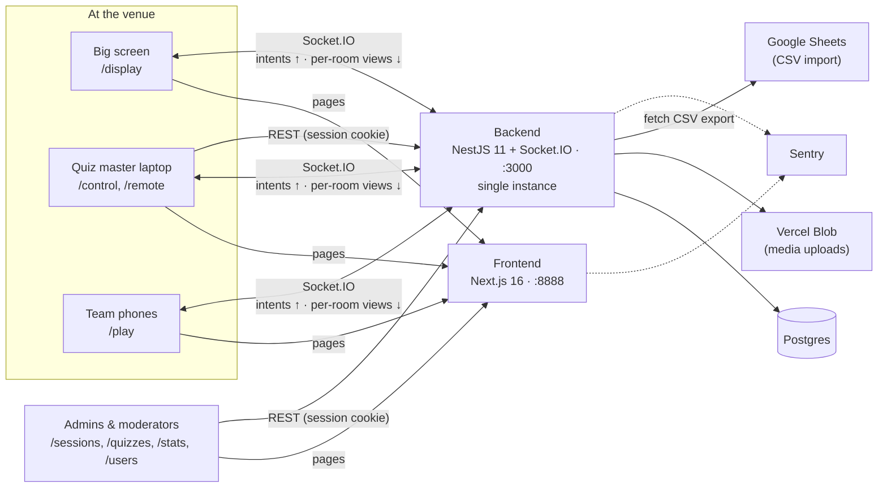
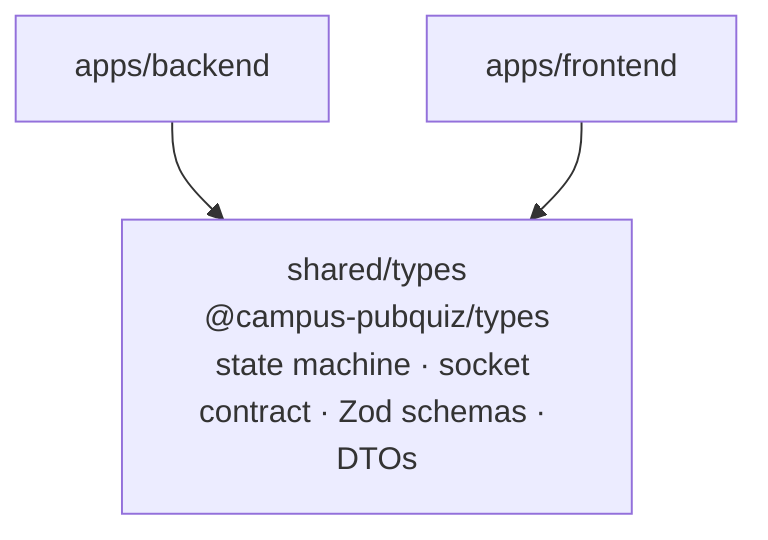
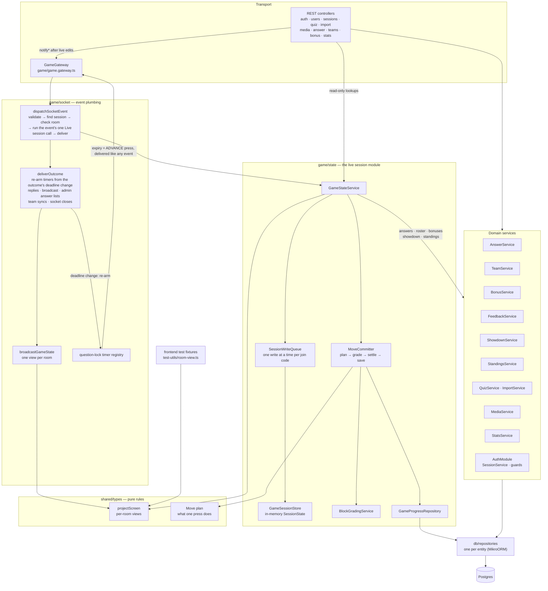
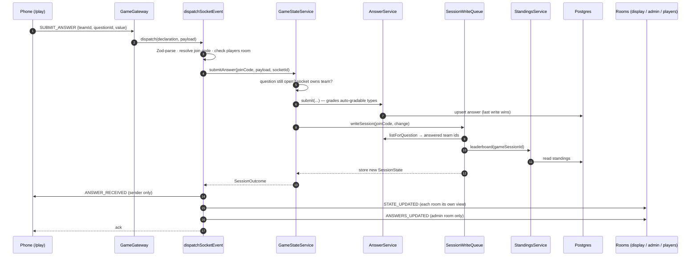
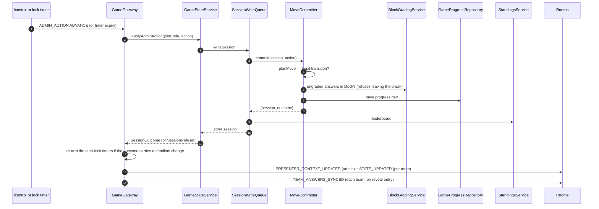
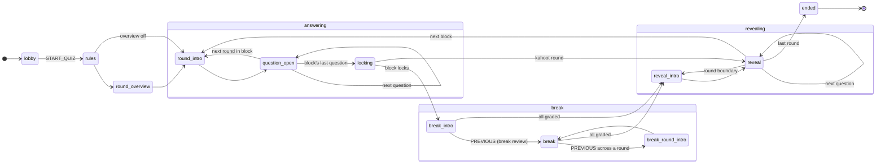
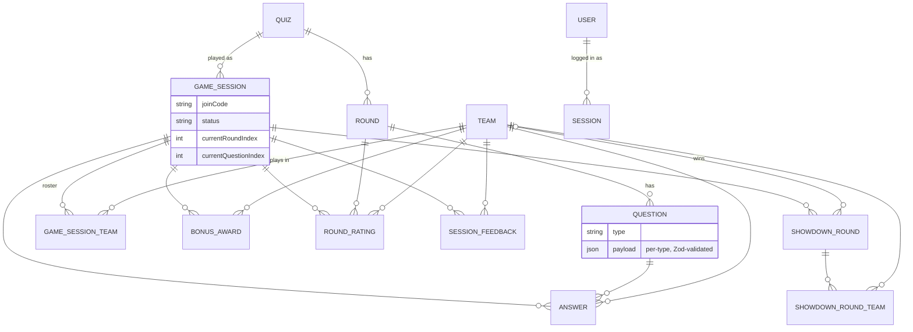
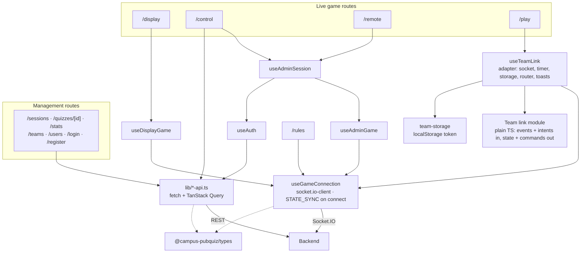

# Architecture Diagrams

Diagrams of how the system is put together. They show structure; the
behaviour behind them (statuses, protocol, persistence rules) is described in
[`DOCUMENTATION.md`](../DOCUMENTATION.md), and domain terms are defined in
[`GLOSSARY.md`](../GLOSSARY.md).

The diagrams are Mermaid: GitHub renders them, and VS Code does with the
"Markdown Preview Mermaid Support" extension (`bierner.markdown-mermaid`).
They are hand-maintained — a change that moves a module, adds an entity or
changes a flow drawn here updates the diagram in the same commit.

- [System context](#system-context)
- [Workspaces](#workspaces)
- [Backend modules](#backend-modules)
- [Event flow: a team submits an answer](#event-flow-a-team-submits-an-answer)
- [Event flow: the quiz master presses Advance](#event-flow-the-quiz-master-presses-advance)
- [Game status machine](#game-status-machine)
- [Data model](#data-model)
- [Frontend modules](#frontend-modules)

## System context

The browser talks to the backend directly — the Next.js app serves pages but
does not proxy the game. The backend is the only writer of game state.

## Workspaces

`shared/types` is the only code both apps share, and it resolves through its
built `dist/` — build it first (`pnpm build` does, in topological order).

## Backend modules

Arrows point from caller to callee. Everything below the transport layer is
reached through `GameStateService` for live sessions, or directly by the REST
controllers for authoring, stats and administration.

Key seams:

- **`dispatchSocketEvent`** is the single template every client-to-server
  event goes through, so rejection order never varies and refusals become
  socket errors in one place.
- **`GameStateService.writeSession`** is the only way a live session changes:
  queued per join code, applied to the session as the previous write left it,
  ends with a standings read, then stored.
- **`MoveCommitter`** is the only place a press (admin action, timer expiry,
  session creation, restart restore) is planned, graded, settled and saved.
- **`projectScreen`** builds each room's view, so nothing a room hasn't been
  shown ever leaves the server. It lives in `shared/types` with the Move plan
  and the other pure rules it reads; the backend calls it, and the frontend's
  test fixtures (`apps/frontend/test-utils/room-view.ts`) run the same
  projection.

## Event flow: a team submits an answer

## Event flow: the quiz master presses Advance

## Game status machine

`ADVANCE` moves forward; `PREVIOUS` walks the same path backward. The full
behaviour of each status is the table in
[DOCUMENTATION.md → Statuses](../DOCUMENTATION.md#statuses).

`END_QUIZ` jumps to `ended` from anywhere; the leaderboard is a flag, not a
status.

## Data model

Authoring time is `QUIZ → ROUND → QUESTION`; everything hanging off
`GAME_SESSION` is runtime. `SESSION` is a login session, not a game session.
Entities: `apps/backend/src/db/entities/`.

## Frontend modules

Every live route renders the view its room receives and sends intents —
it never advances the game or decides what to show on its own.
